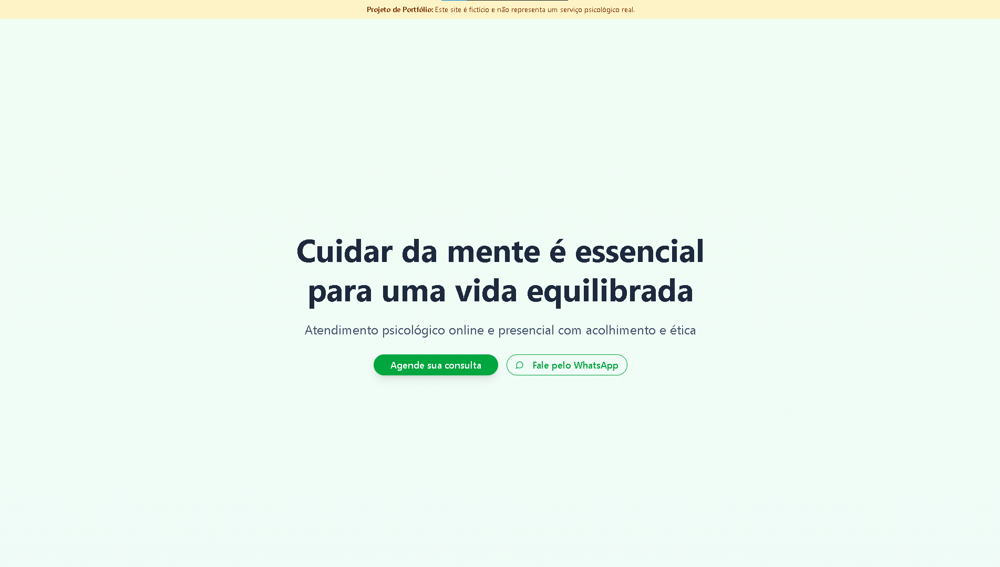

# Landing Page para Psicólogos | Projeto de Portfólio



## 🧠 Sobre o Projeto
Este projeto é uma **Landing Page fictícia para psicólogos**, desenvolvida com **Next.js**, **Tailwind CSS** e **Componentes UI**.  
O objetivo é apresentar um layout moderno, responsivo e elegante para profissionais da área de Psicologia, transmitindo acolhimento, profissionalismo e confiança.

⚠ **Aviso**: Este site é **apenas para fins de portfólio**.  
Todos os nomes, informações, imagens e depoimentos são fictícios e não representam serviços psicológicos reais.

---

## 🚀 Tecnologias Utilizadas
- **Next.js 14** (App Router)
- **React 18**
- **Tailwind CSS** (estilização responsiva)
- **ShadCN/UI Components** (botões, cards, inputs, etc.)
- **Lucide Icons** (ícones modernos)
- **TypeScript** (tipagem segura)

---

## 📸 Layout e Design
A landing page contém:
- **Hero Section** com título chamativo, subtítulo e botões de ação.
- **Seção Sobre a Psicóloga** com foto e bio fictícia.
- **Serviços Oferecidos** (Terapia Individual, Online, Orientação Profissional, etc.)
- **Benefícios** destacados em ícones e texto.
- **Depoimentos Fictícios** para credibilidade.
- **Formulário de Agendamento** funcional (front-end).
- **Rodapé com links úteis, redes sociais e aviso legal**.

---

## ✅ Recursos Extras
- **Aviso de Portfólio** no topo e no rodapé.
- **Botões com CTA (Agendar Consulta e WhatsApp)**.
- **Design Mobile-First** (totalmente responsivo).

---

## 📂 Estrutura do Projeto
```
├── public/
│   ├── img/        # Imagens fictícias para ilustração
│   └── placeholder # Placeholders
├── src/
│   ├── components/ # Componentes reutilizáveis
│   ├── app/        # Páginas e rotas Next.js
│   └── styles/     # Estilos globais
├── package.json
└── README.md
```

---

## 🛠 Como Rodar Localmente
### **Pré-requisitos**
- [Node.js 18+](https://nodejs.org/)
- [npm](https://www.npmjs.com/) ou [yarn](https://yarnpkg.com/)

### **Instalação**
```bash
# Clonar o repositório
git clone https://github.com/seu-usuario/landing-psicologo.git

# Entrar na pasta
cd landing-psicologo

# Instalar dependências
npm install
# ou
yarn install
```

### **Rodar em Desenvolvimento**
```bash
npm run dev
# ou
yarn dev
```

Abra no navegador: **http://localhost:3000**

---

## 📌 Deploy
Este projeto pode ser facilmente hospedado no [Vercel](https://vercel.com/) ou qualquer serviço compatível com **Next.js**.

---

## 👨‍💻 Autor
**Gustavo Vinicius**  
🔗 [Portfólio](https://gustavoviniciusdev.vercel.app/)  
📸 [LinkedIn](https://www.linkedin.com/in/gustavovinicius/)  

---

### ✅ Licença
Este projeto é para fins educacionais e de portfólio.  
Não é um serviço real, nem deve ser utilizado como substituto para atendimento psicológico.
